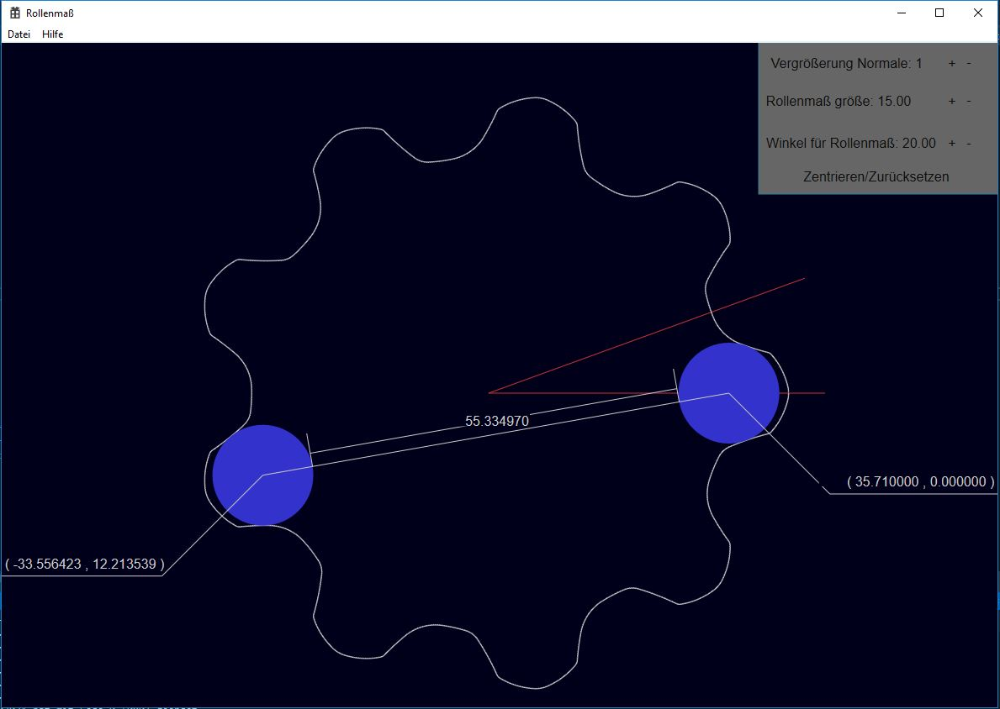

Mit hilfe diesem Programm kann das Rollenmass eines Zahnrad-Innenläufers berechnet werden.

Die Eingabedatei IKO_CADFile.txt befindet sich für einen Testlauf im Projektordner. Es können 
alle Dateien vom Quindos Format mit CSV angabe der Coordinaten eingelesen werden.

Für die grafische Ausgabe wurde meine Direct2D Engine verwendet. Mit der linken Maustaste
kann die Form nach belieben verschoben werden. Mit dem Mausrad kann sie vergrößert werden.
Mit der linken Maustaste kann sie um die Achse verdreht werden.

  
Abbildung 1: Rollenmaß